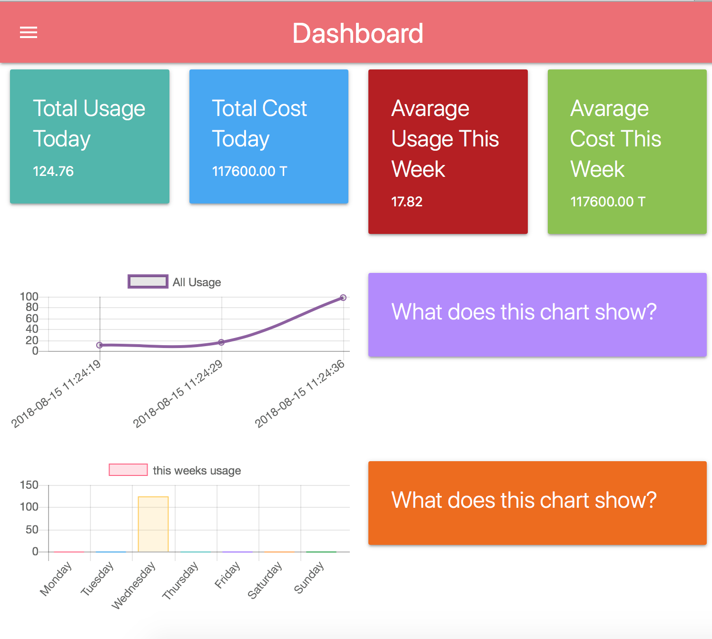
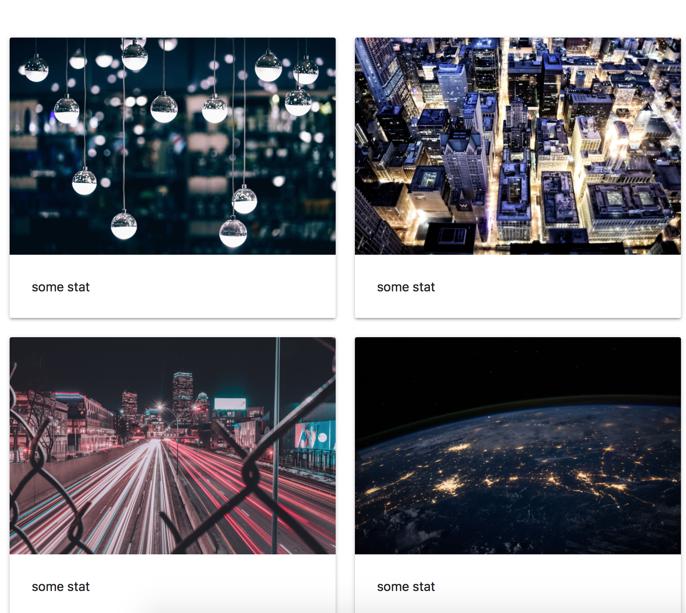
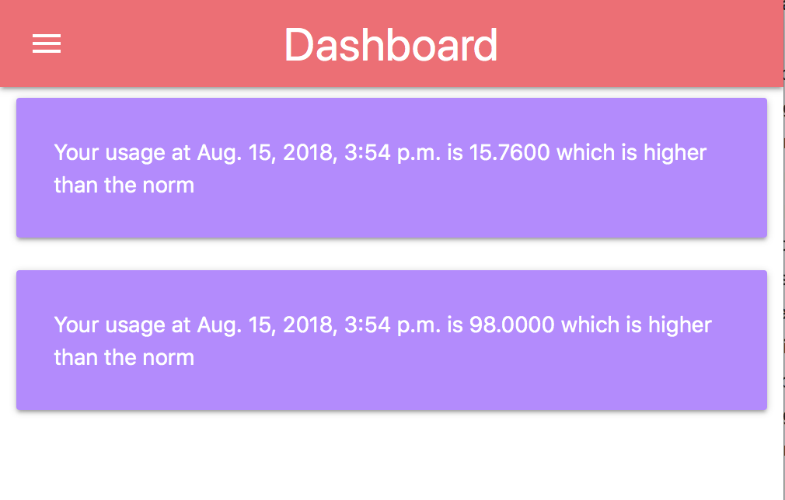
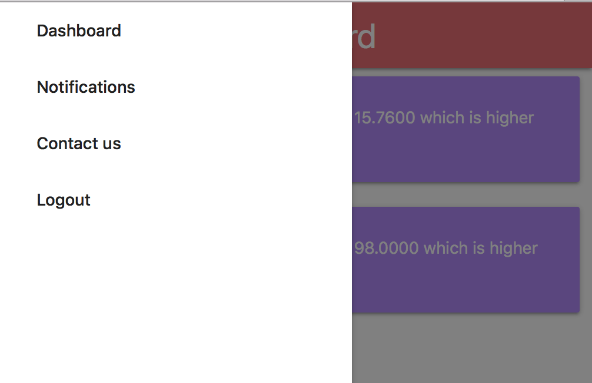
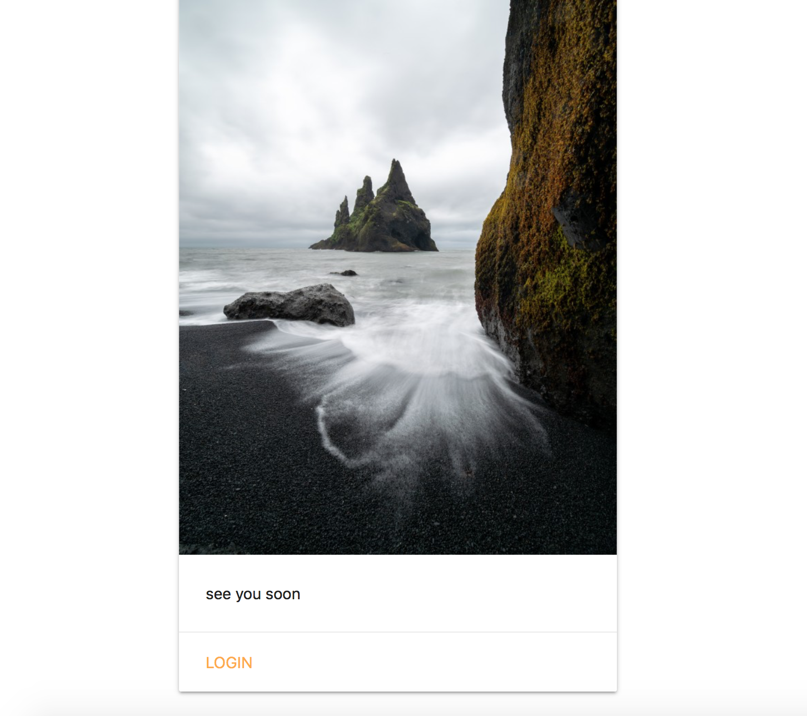

# Django Chart.js Dashboard


<ul>
	<li><a href="note">some notes on how to run it</a></li>
	<li><a href="result">what it looks like</a></li>
</ul>


<h3 id="note">some notes on how to run it</h3>
** you <strong>might</strong> need to have your vpn connected to run the code, because it uses cdns or you could just download the files and place them in your static folder and enjoy

2 of the most important URLs (you can navigate through the rest using the menu):
```bash 
http://127.0.0.1:8000/ -> login page
http://127.0.0.1:8000/collect/ -> where you could input the data that will be displayed in the charts
```

<h3 id="result">what it looks like</h3>




